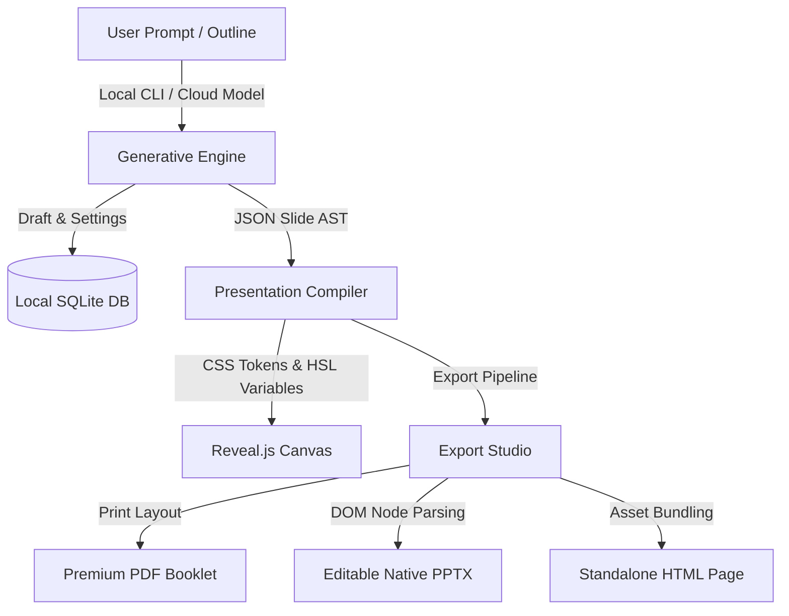

# Open Gamma — the open-source Gamma.app alternative

<p align="center">
  <a href="https://github.com/senapati484/opengamma/stargazers"></a>
  <a href="https://github.com/senapati484/opengamma/network/members"></a>
  <a href="https://github.com/senapati484/opengamma/issues"></a>
  <a href="https://github.com/senapati484/opengamma/pulls"></a>
</p>

### _The premium, local-first, open-source alternative to Gamma.app_
<p align="center">
  <a href="LICENSE"></a>
  <a href="#key-features"></a>
  <a href="#keyboard-shortcuts"></a>
</p>


<p align="center">
  <a href="https://sourceforge.net/projects/open-gamma/files/latest/download"></a>
</p>

<p align="center">
  <a href="https://sourceforge.net/projects/open-gamma/files/latest/download"></a>
  &nbsp;&nbsp;
  <a href="https://sourceforge.net/p/open-gamma/"></a>
</p>

---

## 📖 Overview

**Open Gamma** is a premium, open-source, local-first alternative to **Gamma.app**. Built on a modern **Electron**, **React**, **TypeScript**, and **Reveal.js** desktop architecture, it empowers you to draft, design, refine, and export high-fidelity slides and booklets with local offline security and BYOK (Bring Your Own Key) model flexibility.

All draft presentations, generated assets, slide history, and system settings are securely stored locally inside a lightweight, fast, local SQLite database. No cloud lock-in, no recurring subscription fees, and complete data ownership.

---

## 📥 Download v1.0.0

Choose the compiled installer for your operating system:

| Platform       | Target Architecture    | File Name                         | Size     | Link                                                                                                            |
| :------------- | :--------------------- | :-------------------------------- | :------- | :-------------------------------------------------------------------------------------------------------------- |
| 🪟 **Windows** | x64 (Intel/AMD)        | `Open Gamma 1.0.0.exe`            | 312.2 MB | [Download](https://sourceforge.net/projects/open-gamma/files/v1.0.0/Open%20Gamma%201.0.0.exe/download)          |
| 🍎 **macOS**   | ARM64 (Apple Silicon)  | `Open Gamma-1.0.0-arm64.dmg`      | 356.6 MB | [Download](https://sourceforge.net/projects/open-gamma/files/v1.0.0/Open%20Gamma-1.0.0-arm64.dmg/download)      |
| 🐧 **Linux**   | x64 / ARM64 (AppImage) | `Open Gamma-1.0.0-arm64.AppImage` | 351.1 MB | [Download](https://sourceforge.net/projects/open-gamma/files/v1.0.0/Open%20Gamma-1.0.0-arm64.AppImage/download) |

<details>
<summary><b>🖥️ View Detailed Installation Instructions</b></summary>

### Windows

1. Download the `Open Gamma 1.0.0.exe` installer.
2. Double-click to run.
3. Follow the installation wizard.
4. Launch Open Gamma from your Start menu.

### macOS (Apple Silicon / ARM64)

1. Download the `Open Gamma-1.0.0-arm64.dmg` file.
2. Double-click to mount the DMG file.
3. Drag the **Open Gamma** application icon into your **Applications** folder.
4. Launch from Applications or Spotlight search.

### Linux

1. Download the `Open Gamma-1.0.0-arm64.AppImage` file.
2. Make it executable via terminal:
   ```bash
   chmod +x Open\ Gamma-1.0.0-arm64.AppImage
   ```
3. Run the AppImage:
   ```bash
   ./Open\ Gamma-1.0.0-arm64.AppImage
   ```
   </details>

---

## ✨ Key Features

- 🔮 **Generative Slide AI Scaffolding**: Paste complex prompts or structured outlines to compile booklet structure and slide content in real time.
- 🎨 **15+ High-Fidelity Design Themes**: Switch between styled presets like _Startup Gradient_, _Noir Gold_, _Academic Clean_, _Terminal Green_, _Void Lime_, and more, with instant HSL rendering.
- 💾 **Local-First Architecture**: 100% offline-compatible database (SQLite) for draft history, version control, and settings. No cloud dependencies.
- 🎙️ **Local Kokoro TTS Voiceover**: Generate voice narration directly on your machine using Kokoro TTS model inference.
- 📄 **Export Studio**: Compile booklets to premium print-ready PDF, editable native PowerPoint (`.pptx`), static images (`.png`), or interactive offline webpage presentations (`.html`).
- ⌨️ **Keyboard shortcuts**: Designed for speed with intuitive global key bindings.

---

## ⚙️ Architecture Workflow

The compilation pipeline converts user inputs and outlines into offline presentation artifacts:



---

## ⌨️ Keyboard Shortcuts

Speed up your booklet design workflow with these keyboard shortcuts:

| Shortcut                               | Action                                | Scope               |
| :------------------------------------- | :------------------------------------ | :------------------ |
| <kbd>⌘ / Ctrl</kbd> + <kbd>Enter</kbd> | Submit draft prompt / compile outline | Form Editor         |
| <kbd>⌘ / Ctrl</kbd> + <kbd>E</kbd>     | Open the Export Studio                | Global              |
| <kbd>⌘ / Ctrl</kbd> + <kbd>S</kbd>     | Save changes to active slide          | Slide Editor Modal  |
| <kbd>⌘ / Ctrl</kbd> + <kbd>,</kbd>     | Open Settings panel                   | Global              |
| <kbd>Escape</kbd>                      | Dismiss modals / cancel compile       | Global              |
| <kbd>←</kbd> / <kbd>→</kbd>            | Step backward / forward in history    | Presentation Canvas |
| <kbd>⌘ / Ctrl</kbd> + <kbd>Z</kbd>     | Undo last slide modification          | Presentation Canvas |

---

## 🛠️ Local Development Setup

If you want to build Open Gamma from source or customize its features:

### Prerequisites

- **Node.js**: `v18+` or `v20+` is highly recommended.
- **NPM** (packaged with Node).

### 1. Clone & Install

```bash
git clone https://github.com/senapati484/opengamma.git
cd opengamma
npm install
```

### 2. Run Dev Environment

Starts the hot-reloading main process and React front-end development server:

```bash
npm run dev
```

### 3. Packaging & Compiling

Create standalone production executables and installers:

```bash
# General production compile
npm run build

# Package for macOS (Intel & Apple Silicon)
npm run build:mac

# Package for Windows
npm run build:win

# Package for Linux
npm run build:linux
```

Outputs are compiled into the `out/` directory.

---

## 📁 Repository Tour

```
opengamma/
├── docs/                      # Research, features, and design specs
├── resources/                 # Application icons and OS configurations
├── src/
│   ├── main/                  # Electron Main Process (IPC, SQLite DB, File I/O)
│   │   ├── cliRunner.ts       # Executes CLI tools for local generation
│   │   ├── cliScanner.ts      # Scans system path for local generative CLIs
│   │   ├── db.ts              # Database schema migrations & SQLite connection
│   │   ├── exporter.ts        # PDF/HTML compilation scripts
│   │   ├── generator.ts       # AI draft outline orchestrator
│   │   ├── htmlToPptx.ts      # HTML markup parsing to native PPTX slides
│   │   ├── ipc.ts             # Main process IPC listener bridge
│   │   └── slideParser.ts     # Parsing raw slide markdown structures
│   ├── preload/               # Electron Preload (Safe context bridge)
│   └── renderer/              # React front-end (UI components, themes, editor)
│       └── src/
│           ├── components/    # Reusable UI controls, modals, and canvas layers
│           ├── context/       # App context state management
│           ├── lib/           # Slide compiler utilities and theme tokens
│           └── styles/        # Global layout styling and Tailwind configuration
```

---

## 🤝 Contributing

We welcome open-source contributions! Check out our [Contributing Guidelines](CONTRIBUTING.md) to learn how to help build the best local-first presentation tool.

---

## 🔒 Security & Privacy

Open Gamma is built on a **privacy-first philosophy**:

- **No Telemetry**: We do not collect analytical data, crash dumps, or usage patterns.
- **Offline Storage**: Your database remains purely local on your disk.
- **BYOK (Bring Your Own Key)**: Choose your LLM model provider and connect directly to their API endpoints with complete key security.

---

## 📄 License

Open Gamma is licensed under the [Apache License 2.0](LICENSE). See [LICENSE](LICENSE) file for more information.
