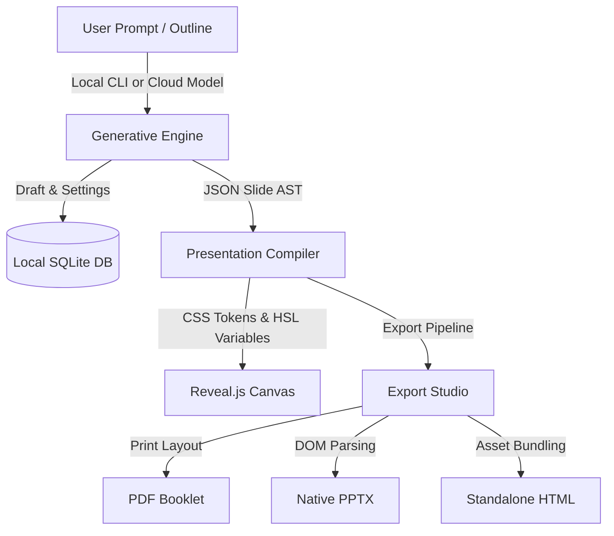

<div align="center">

<br/>

<!-- Logo — matching the official OpenGamma brand -->
<picture>
  
</picture>

<br/>
<br/>

<h3>The open-source, local-first alternative to Gamma.app</h3>

<p>Design beautiful AI presentations — 100% offline, no subscriptions, no watermarks, your data and your keys.</p>

<br/>

[](https://github.com/senapati484/opengamma/stargazers)
[](https://github.com/senapati484/opengamma/network/members)
[](https://github.com/senapati484/opengamma/issues)
[](https://github.com/senapati484/opengamma/pulls)
[](https://sourceforge.net/projects/open-gamma/files/latest/download)
[](LICENSE)

<br/>

[](https://youtu.be/O170F-KqtUw?si=Xg-R7onfbVyWbSHB)
&nbsp;&nbsp;
[](https://sourceforge.net/projects/open-gamma/files/latest/download)

<br/>

---

</div>

<br/>


<br/><br/>


<br/>

---

## What is Open Gamma?

**Open Gamma** is a premium desktop application and a free, open-source alternative to Gamma.app. It gives you the full power of AI-assisted slide creation — without a cloud subscription, without vendor lock-in, and without your data leaving your machine.

Built on **Electron**, **React**, **TypeScript**, and **Reveal.js**, Open Gamma stores all drafts, presentation history, assets, and settings in a local **SQLite** database. Bring your own API key (BYOK) and connect directly to any supported LLM provider.

> **No cloud lock-in. No recurring fees. No watermarks. Complete data ownership.**

---

## Features

| | Feature | Description |
|---|---|---|
| 🔮 | **AI Slide Scaffolding** | Paste a prompt or structured outline and compile full slide decks in real time |
| 🎨 | **15+ Design Themes** | Switch between _Startup Gradient_, _Noir Gold_, _Terminal Green_, _Void Lime_, and more with instant HSL rendering |
| 💾 | **Local-First Architecture** | 100% offline SQLite storage — no cloud dependencies, ever |
| 🎙️ | **Kokoro TTS Voiceover** | Generate on-device voice narration via local Kokoro TTS model inference |
| 📄 | **Export Studio** | Export to **PDF**, **PowerPoint (.pptx)**, **PNG images**, or **standalone HTML** |
| 🔑 | **BYOK Model Support** | Connect any LLM provider with your own API key — full key security, no middleman |
| ⌨️ | **Global Keyboard Shortcuts** | Designed for speed with intuitive hotkeys throughout the entire app |
| 🛡️ | **Zero Telemetry** | No crash dumps, no analytics, no usage data collected — ever |

---

## Download

> **Current release: v1.0.1** — Available on Windows, macOS, and Linux

| Platform | Architecture | File | Size | Download |
|:---|:---|:---|:---|:---|
| 🪟 **Windows** | x64 (Intel / AMD) | `Open Gamma 1.0.1.exe` | 312.2 MB | [**Download**](https://sourceforge.net/projects/open-gamma/files/v1.0.1/Open%20Gamma%201.0.1.exe/download) |
| 🍎 **macOS** | ARM64 (Apple Silicon) | `Open Gamma-1.0.1-arm64.dmg` | 356.6 MB | [**Download**](https://sourceforge.net/projects/open-gamma/files/v1.0.1/Open%20Gamma-1.0.1-arm64.dmg/download) |
| 🐧 **Linux** | x64 / ARM64 | `Open Gamma-1.0.1-arm64.AppImage` | 351.1 MB | [**Download**](https://sourceforge.net/projects/open-gamma/files/v1.0.1/Open%20Gamma-1.0.1-arm64.AppImage/download) |

<a href="https://sourceforge.net/projects/open-gamma/files/latest/download">
  
</a>

<details>
<summary><b>Installation Instructions</b></summary>

<br/>

### 🪟 Windows

1. Download `Open Gamma 1.0.1.exe`
2. Double-click the installer and follow the setup wizard
3. Launch from your Start menu

### 🍎 macOS (Apple Silicon)

1. Download `Open Gamma-1.0.1-arm64.dmg`
2. Mount the DMG and drag **Open Gamma** into your **Applications** folder
3. Launch from Applications or Spotlight

### 🐧 Linux

1. Download `Open Gamma-1.0.1-arm64.AppImage`
2. Make it executable:
   ```bash
   chmod +x "Open Gamma-1.0.1-arm64.AppImage"
   ```
3. Run it:
   ```bash
   ./"Open Gamma-1.0.1-arm64.AppImage"
   ```

</details>

---

## Architecture

Open Gamma converts prompts and outlines into offline presentation artifacts through a clean local pipeline:



---

## Keyboard Shortcuts

| Shortcut | Action | Scope |
|:---|:---|:---|
| `Cmd / Ctrl` + `Enter` | Submit prompt / compile outline | Form Editor |
| `Cmd / Ctrl` + `E` | Open Export Studio | Global |
| `Cmd / Ctrl` + `S` | Save active slide | Slide Editor |
| `Cmd / Ctrl` + `,` | Open Settings | Global |
| `Escape` | Dismiss modals / cancel compile | Global |
| `←` / `→` | Step backward / forward in history | Presentation Canvas |
| `Cmd / Ctrl` + `Z` | Undo last slide modification | Presentation Canvas |

---

## Local Development

### Prerequisites

- **Node.js** v18+ (v20+ recommended)
- **npm** (bundled with Node)

### Setup

```bash
# Clone the repository
git clone https://github.com/senapati484/opengamma.git
cd opengamma

# Install dependencies
npm install

# Start the development server (hot-reload enabled)
npm run dev
```

### Build for Production

```bash
npm run build        # General production build
npm run build:mac    # macOS (Intel + Apple Silicon)
npm run build:win    # Windows
npm run build:linux  # Linux
```

Output is written to the `out/` directory.

---

## Repository Structure

```
opengamma/
├── docs/                       # Research, features, and design specs
├── resources/                  # App icons and OS configurations
└── src/
    ├── main/                   # Electron main process
    │   ├── cliRunner.ts        # Executes local generation CLIs
    │   ├── cliScanner.ts       # Scans system path for generative CLIs
    │   ├── db.ts               # SQLite schema migrations & connection
    │   ├── exporter.ts         # PDF / HTML compilation scripts
    │   ├── generator.ts        # AI outline orchestrator
    │   ├── htmlToPptx.ts       # HTML → native PPTX conversion
    │   ├── ipc.ts              # Main process IPC bridge
    │   └── slideParser.ts      # Raw slide markdown parser
    ├── preload/                # Electron context bridge
    └── renderer/               # React frontend
        └── src/
            ├── components/     # UI controls, modals, and canvas layers
            ├── context/        # App-wide state management
            ├── lib/            # Slide compiler utilities and theme tokens
            └── styles/         # Global styles and Tailwind config
```

---

## Privacy & Security

Open Gamma is built on a **privacy-first philosophy**:

- **No Telemetry** — zero analytical data, crash dumps, or usage patterns collected
- **Offline Storage** — all data stays on your disk inside a local SQLite database
- **BYOK** — connect directly to your LLM provider of choice with complete API key security
- **Open Source** — every line of code is publicly auditable

---

## Contributing

Contributions are welcome! Whether it's a bug fix, a new theme, a feature improvement, or documentation — we'd love your help.

Please read our [Contributing Guidelines](CONTRIBUTING.md) before opening a pull request.

**Ways to contribute:**
- 🐛 [Report a bug](https://github.com/senapati484/opengamma/issues/new?template=bug_report.md)
- 💡 [Request a feature](https://github.com/senapati484/opengamma/issues/new?template=feature_request.md)
- 🔧 [Submit a pull request](https://github.com/senapati484/opengamma/pulls)
- ⭐ Star the repo to show your support

---

## License

Open Gamma is released under the [Apache License 2.0](LICENSE).

---

<div align="center">

<br/>

<picture>
  
</picture>

<br/><br/>

Built with ❤️ by the open-source community

[](https://github.com/senapati484/opengamma)
&nbsp;
[](https://sourceforge.net/projects/open-gamma/)
&nbsp;
[](https://sourceforge.net/projects/open-gamma/files/latest/download)

<br/>

</div>
